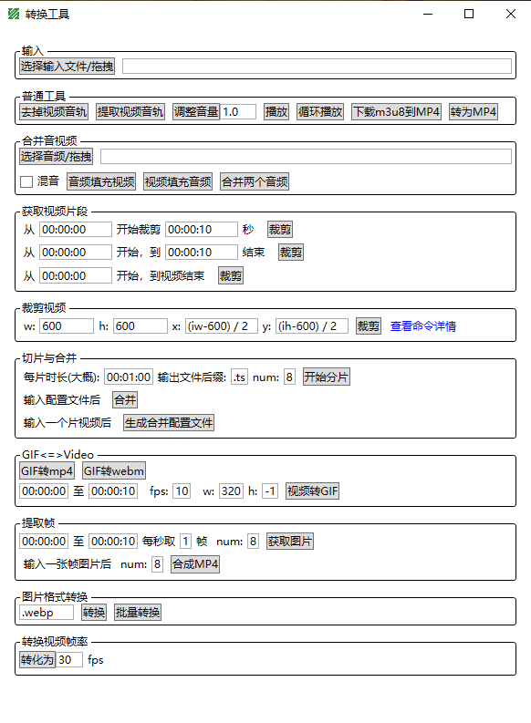

## 处理视频/音频/图片的简单工具

- [ffmpeg](https://ffmpeg.org/)
- [下载ffmpeg.exe](https://github.com/BtbN/FFmpeg-Builds/releases)(lgpl.zip)，然后将bin目录添加到PATH环境变量，或者将bin下面的exe拷贝到本软件的exe同级目录下
- 没有找到ffmpeg.exe将无法运行

