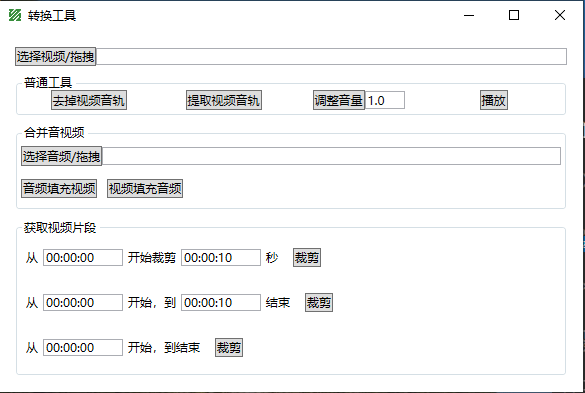

## 使用FFmpeg命令行处理视频的简单工具

- [ffmpeg官网](https://ffmpeg.org/)
- [下载ffmpeg](https://github.com/BtbN/FFmpeg-Builds/releases)可执行文件(lgpl.zip)，然后将bin目录添加到PATH环境变量，或者将bin下面的exe拷贝到本软件的exe同级目录下
- 没有找到ffmpeg.exe将无法运行

